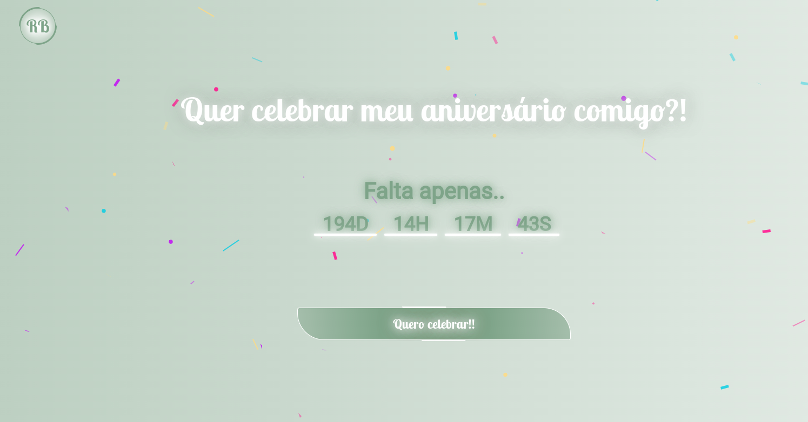

# Landing Page Aniversário

Landing Page desenvolvida com JavaScript, HTML e SASS, com automação de tarefas utilizando Gulp. 
A página inclui um contador regressivo que exibe dias, horas, minutos e segundos até o meu próximo aniversário,
com a funcionalidade de atualizar automaticamente para o ano seguinte após o término do contador. 
Além disso, integra uma biblioteca de geração infinita de confetes para comemorar a data de forma interativa.
 
 

## Tecnologias Utilizadas

&nbsp;
&nbsp;
&nbsp;
&nbsp;
 
 

## Link Demo: [Landing Page Aniversário](https://landing-evento-ten.vercel.app/)

  

